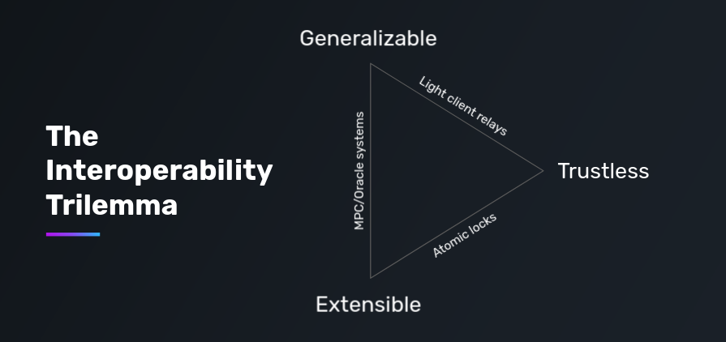
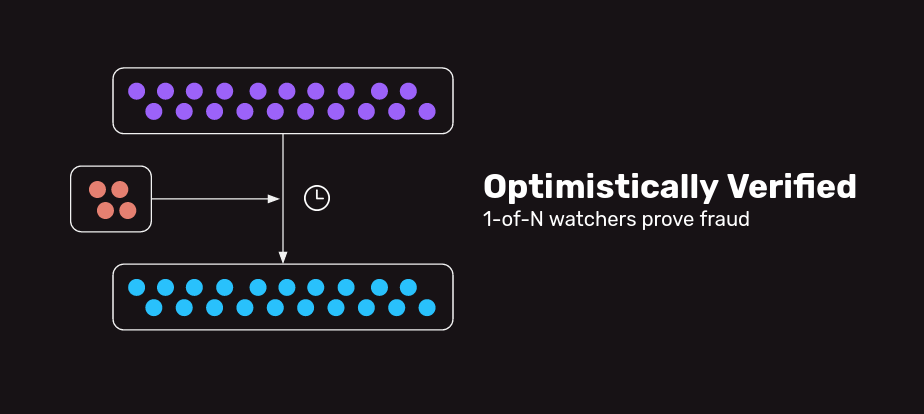

# Trust assumptions

## The Bridging Landscape

One of the key challenges of blockchains & distributed systems is that they **always have tradeoffs.**

For bridges, historically this has meant that bridges can only have two of the following three properties:

1. **Trust-minimization:** The system does not introduce new trust/security assumptions beyond those of the underlying chains.
2. **Generalizeability:** The system supports passing around arbitrary data and not just funds.
3. **Extensibility:** The system can be deployed without lots of custom work for a variety of different types of underlying chains.

We can classify all bridges by their properties/tradeoffs:

| Type | Examples | Properties | Tradeoffs |
| --- | --- | --- | --- |
| Light client header relays | IBC | Trust-minimization, Generalizeability | Extensibility |
| MPC, oracle/relay, PoS systems | Multichain, Synapse, LayerZero, Axelar, Thorchain, Celer | Generalizeability, Extensibility | Trust-minimization |
| Conditional transfer systems | Hop, Connext (v1) | Trust-minimization, Extensibility | Generalizeability |

💡 Learn more: [The Interoperability Trilemma](https://blog.connext.network/the-interoperability-trilemma-657c2cf69f17)

## Optimistic Bridges

Optimistic bridges create another tradeoff, **latency.**

Optimistic bridges, similar to optimistic rollups, use **fraud proofs** to ensure the validity of data relayed across chains. Every message that passes through an optimistic bridge remains in a “pending” state during the dispute window until it is considered valid. During this time, **watchers** can dispute the message if the data is incorrect.

💡 Learn more: [Optimistic Bridges](https://blog.connext.network/optimistic-bridges-fb800dc7b0e0)
